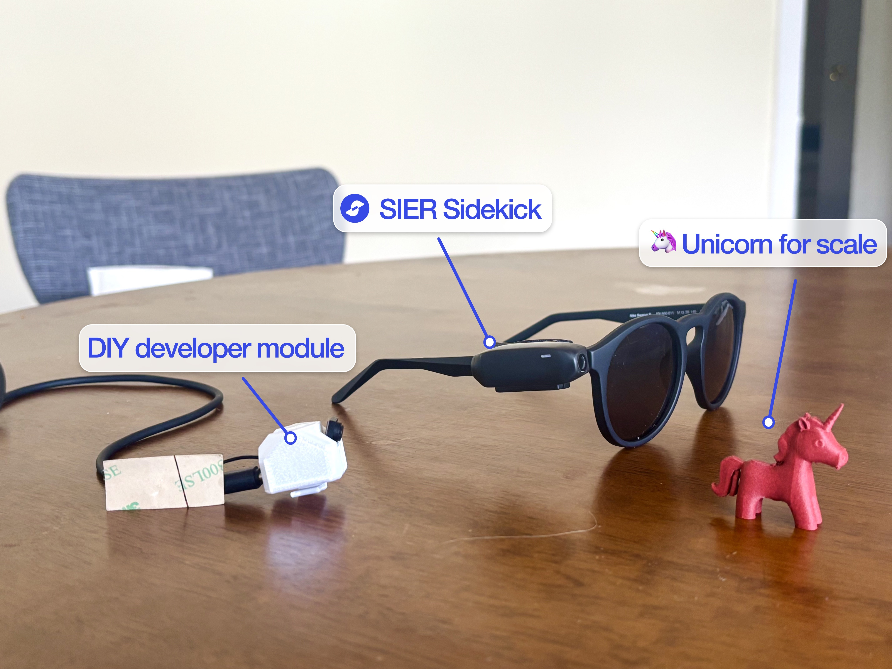
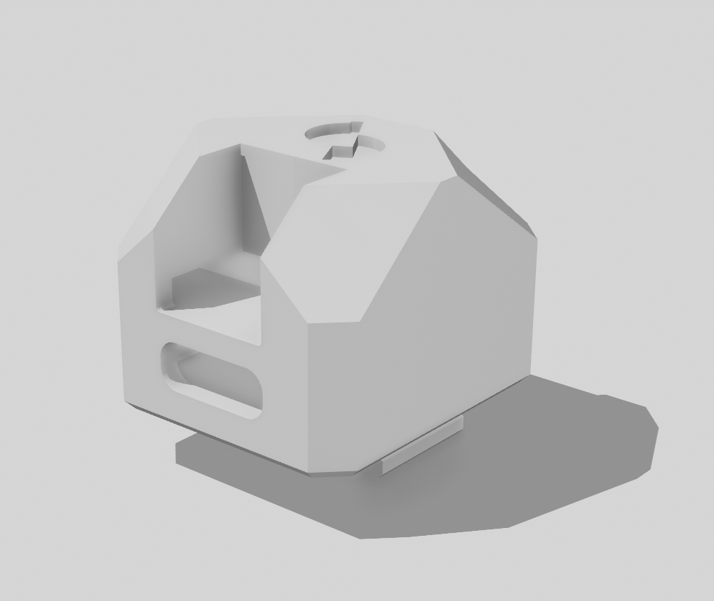

# SidekickOS - Open Source Smart Glasses



An open-source implementation of smart glasses functionality, inspired by the [SIER Sidekick](https://siertech.com). Transform any glasses into smart glasses with camera capture, audio streaming, and AI assistance capabilities.


## 🎯 **What is SidekickOS?**

SidekickOS is an open-source smart glasses platform that provides:

- **📷 High-Resolution Camera Capture** - Up to 1600x1200 native
- **🎤 Audio Streaming** - G.711 μ-law encoded audio over BLE (Work in Progress)
- **📱 Multi-Platform Clients** - Python API and Web browser interface
- **⚡ Ultra-Performance** - Optimized BLE 5.0 with 517-byte MTU and Data Length Extension
- **🔧 Modular Design** - Separate firmware and client components
- **🌍 Cross-Platform** - Works on Mac, Windows, Linux, and mobile apps (React Native in development)

### **Developed with SIER Technologies**

This project is developed in collaboration with [SIER Technologies](https://siertech.com), makers of the Sidekick smart glasses:
- Turn any glasses into smart glasses
- Capture life with high-quality camera
- Voice-activated AI assistance (through client integration)
- Live streaming capabilities (through client apps)
- Hands-free operation


## 🚀 **Quick Start**

### **1. Hardware Setup**

**Required Hardware:**
- XIAO ESP32S3 Sense (with camera and microphone)
- USB-C cable for programming

**3D Printable Hardware:**
- **CAD Model**: [`hardware/SidekickOS-ESP32S3-v1.step`](hardware/SidekickOS-ESP32S3-v1.step) - Full 3D model for modifications
- **3D Print Files**: 
  - [`hardware/SidekickOS-ESP32S3-v1-print.stl`](hardware/SidekickOS-ESP32S3-v1-print.stl) - STL format
  - [`hardware/SidekickOS-ESP32S3-v1-print.3mf`](hardware/SidekickOS-ESP32S3-v1-print.3mf) - 3MF format (recommended)

**Hardware Renders:**
| Front View | Back View |
|------------|-----------|
|  |  |

**Note:** 3D printable mounting solution now available! See [`docs/hardware.md`](docs/hardware.md) for complete assembly instructions.

### **2. Firmware Installation**

```bash
# Clone the repository
git clone https://github.com/siersidekick/SidekickOS.git
cd sidekickos/firmware

# Install ESP-IDF (if not already installed)
# Follow: https://docs.espressif.com/projects/esp-idf/en/latest/esp32/get-started/

# Build and flash firmware
idf.py build
idf.py flash monitor
```

### **3. Client Setup**

**Python Client:**
```bash
cd sidekickos-client
pip install -e .
python demos/example_camera_usage.py
```

**Web Client:**
```bash
# Simply open demos/sidekickos-web-client.html in a modern desktop browser
# Requires Web Bluetooth API support (Chrome/Edge on desktop only)
# Note: iOS Safari and mobile browsers do not support Web Bluetooth
```

## 📱 **Client Applications**

### **Python Client (`sidekickos-client/`)**

**Features:**
- Full camera control and streaming
- High-resolution image capture (up to 1920x1080)
- Audio streaming and processing (Work in Progress)
- Performance monitoring
- Cross-platform (Mac, Windows, Linux)

**Usage:**
```python
from sidekickos import ESP32Camera

camera = ESP32Camera()
await camera.connect()
image = await camera.capture_image()
image.save("photo.jpg")
```

### **Web Client (`sidekickos-client/sidekickos-web-client.html`)**

**Features:**
- Browser-based interface (no installation required)
- Real-time camera streaming
- Audio streaming with Web Audio API (Work in Progress)
- Performance monitoring dashboard
- Desktop compatible (Chrome/Edge only, no iOS/mobile browser support)

**Usage:**
1. Open `sidekickos-client/sidekickos-web-client.html` in Chrome/Edge (desktop only)
2. Click "Connect to Camera"
3. Start capturing photos or streaming video

**Mobile App (React Native):**
- iOS and Android app in development
- Will provide full mobile BLE support
- Expected release: next few months

## 🔧 **Technical Specifications**

### **ESP32S3 Firmware**
- **Camera**: OV2640 sensor, JPEG compression
- **Audio**: PDM microphone, G.711 μ-law encoding
- **Connectivity**: BLE 5.0 with Data Length Extension
- **Performance**: 300+ kbps bandwidth, 30 FPS capability
- **Resolutions**: 96x96 to 1600x1200 native

### **BLE Protocol**
- **Service UUID**: `12345678-1234-1234-1234-123456789abc`
- **MTU**: Up to 517 bytes (BLE 5.0 DLE)
- **Chunk Size**: 510 bytes optimized
- **Audio**: 8kHz, 16-bit PCM → G.711 μ-law
- **Commands**: Quality, resolution, streaming control

### **Performance Metrics**
- **Image Transfer**: 200-400 kbps
- **Audio Streaming**: 12.8 kbps (Work in Progress)
- **Latency**: 1-3 seconds per frame
- **Range**: 10-30 meters
- **Battery Life**: Several hours (depends on usage and hardware configuration)

## 🎮 **Usage Examples**

### **Basic Photo Capture**
```python
# Python
import asyncio
from sidekickos import ESP32Camera

async def take_photo():
    camera = ESP32Camera()
    await camera.connect()
    
    # Set high quality
    await camera.set_quality(10)
    await camera.set_resolution(8)  # VGA
    
    # Capture image
    image = await camera.capture_image()
    image.save("my_photo.jpg")
    
    await camera.disconnect()

asyncio.run(take_photo())
```

### **Live Streaming**
```python
# Python streaming
def frame_callback(frame):
    print(f"Frame {frame.frame_number}: {frame.size} bytes")
    frame.save(f"frame_{frame.frame_number:04d}.jpg")

await camera.start_streaming(frame_callback, interval=0.5)
await asyncio.sleep(10)  # Stream for 10 seconds
await camera.stop_streaming()
```

### **🐕 Smart Dog Detection Demo**
```bash
cd sidekickos-client
pip install -e .
python demos/dog_detection/simple_dog_detector.py
```


## 🛠️ **Development**

### **Firmware Development**
```bash
cd firmware
idf.py menuconfig  # Configure project
idf.py build       # Build firmware
idf.py flash       # Flash to device
idf.py monitor     # View serial output
```

### **Client Development**
```bash
cd sidekickos-client
pip install -e .   # Install in development mode
python -m pytest   # Run tests (if available)
```

### **Adding New Features**

**Firmware Side:**
1. Add new BLE characteristics in `main/main.c`
2. Implement command handlers
3. Update protocol documentation

**Client Side:**
1. Extend `ESP32Camera` class in `sidekickos/__init__.py`
2. Add new methods and callbacks
3. Update examples and documentation

## 📊 **Performance Optimization**

### **For Maximum Quality**
- Use VGA (640x480) or higher resolution
- Set quality to 4-10 (lower = better)
- Use Python client for post-processing
- Enable image enhancement and upscaling

### **For Maximum Speed**
- Use QVGA (320x240) resolution
- Set quality to 25-30
- Use 1-2 second frame intervals
- Use Web client for real-time viewing

### **For Battery Life**
- Reduce frame rate (5+ second intervals)
- Lower resolution (QVGA or below)
- Disable audio streaming when not needed
- Use deep sleep between captures

## 🤝 **Contributing**

We welcome contributions! Please see [CONTRIBUTING.md](CONTRIBUTING.md) for guidelines.

**Areas for Contribution:**
- AI integration (ChatGPT, local models)
- Computer vision demos (expand beyond dog detection)
- React Native mobile app development
- Audio streaming improvements
- Performance optimizations
- Documentation improvements

## 🤖 **AI-Powered Demos**

### **🐕 Dog Detection Demo**
```bash
cd sidekickos-client
pip install -e .
python demos/dog_detection/simple_dog_detector.py
```

Detects dogs and saves photos to "cute dogs" folder.

📹 **[Watch Demo Video](https://drive.google.com/file/d/1LnD9ZVXxRB4CjpYO92vVTl6aJtVk8wdE/view?usp=sharing)** - See dog detection in action!

## 📄 **License**

This project is licensed under the MIT License - see the [LICENSE](LICENSE) file for details.

## 🙏 **Acknowledgments**

- Developed in collaboration with [SIER Technologies](https://siertech.com), makers of the Sidekick smart glasses
- Built on ESP-IDF framework and ESP32S3 platform
- Uses Seeed Studio XIAO ESP32S3 Sense hardware
- Community contributions and feedback

## 📚 **Documentation**

Comprehensive documentation is available in the `docs/` directory:

- **[📖 Documentation Index](docs/index.md)** - Complete documentation navigation
- **[Python Library Guide](docs/python-library.md)** - Complete Python client documentation
- **[Demo Scripts](docs/demos.md)** - Guide to all demo applications
- **[Firmware Guide](docs/firmware.md)** - ESP32S3 firmware documentation
- **[Hardware Setup](docs/hardware.md)** - Hardware compatibility and setup
- **[Contributing](CONTRIBUTING.md)** - Guidelines for contributors

## 📞 **Support**

- **Issues**: Open a GitHub issue for bugs or feature requests
- **Discussions**: Use GitHub Discussions for questions and ideas
- **Documentation**: See links above for detailed guides

## 🔮 **Roadmap**

**Current (v1.0):**
- ✅ Basic camera streaming
- ✅ Python and Web clients (desktop)
- ✅ High-resolution capture
- ✅ Performance optimization
- 🔄 Audio streaming (Work in Progress)

**Planned (v1.1):**
- 🔄 React Native mobile app (iOS/Android)
- 🔄 Complete audio streaming implementation
- 🔄 AI integration (ChatGPT, local models)
- 🔄 Voice activation ("Hey Sidekick")

**Future (v2.0):**
- 🔄 Live streaming to social platforms
- 🔄 Real-time object recognition
- 🔄 Augmented reality overlays
- 🔄 Advanced AI assistant features

---

**Turn any glasses into smart glasses with SidekickOS! 🤓✨**
